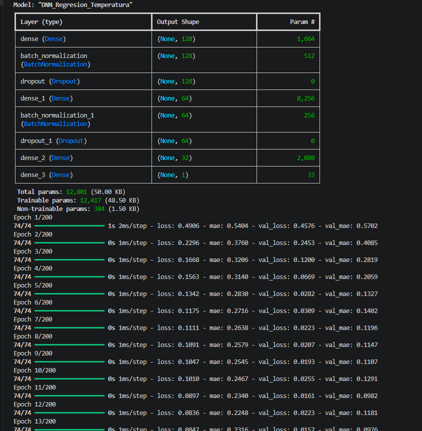
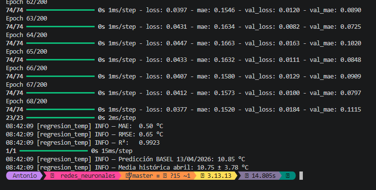

# Memoria Justificativa — Reto de Predicción Meteorológica con DNN

**Dataset utilizado:** Weather Prediction Dataset (Florian Huber, Zenodo/GitHub)  
**Fuente:** https://github.com/florian-huber/weather_prediction_dataset  
**Descripción:** 18 ciudades europeas, observaciones diarias 2000–2010, con variables como temperatura media/máx/mín, humedad, precipitación, presión, cobertura nubosa, radiación global, horas de sol y velocidad del viento.

---

## Script 1: Estimación Térmica (Regresión)

### 1. Función de activación en la última capa: `linear`

La temperatura es una variable continua que puede tomar cualquier valor real (positivo o negativo). La activación lineal (identidad) no aplica ninguna transformación a la salida de la neurona, lo que permite al modelo generar cualquier valor numérico. Usar sigmoid o relu sería un error: sigmoid acotaría la salida a [0, 1] y relu eliminaría los valores negativos, ambos incompatibles con rangos de temperatura reales.

### 2. Función de coste: `MSE` (Mean Squared Error)

MSE es la función de pérdida estándar para problemas de regresión. Calcula la media del cuadrado de las diferencias entre predicciones y valores reales. Al elevar al cuadrado, penaliza proporcionalmente más los errores grandes, lo que empuja al modelo a evitar desviaciones extremas. La alternativa sería MAE (Mean Absolute Error), que es más robusta a outliers pero tiene gradientes discontinuos en cero, lo que puede dificultar la optimización. Para datos meteorológicos relativamente bien distribuidos, MSE es la elección más directa.

### 3. Métricas de evaluación y resultados obtenidos

- **MAE: 0.50 °C** — el modelo se desvía medio grado de media. Para una estimación térmica operativa, esto es más que suficiente.
- **RMSE: 0.65 °C** — la cercanía entre MAE y RMSE indica que no hay errores atípicos grandes.
- **R²: 0.9923** — el modelo explica el 99.2% de la varianza de la temperatura. Resultado excelente.
- **Predicción 13/04/2026: 10.85 °C** — coherente con la media histórica de abril en Basel (10.75 ± 3.78 °C).

El modelo entrenó durante 68 epochs antes de que el EarlyStopping detuviera el entrenamiento (mejor val_loss en epoch 53 con 0.0072). La convergencia fue rápida y estable.

**Criterio de aceptación para la empresa:** con un MAE de 0.50 °C y un R² de 0.99, el modelo supera ampliamente los umbrales razonables (MAE < 3 °C, R² > 0.85).