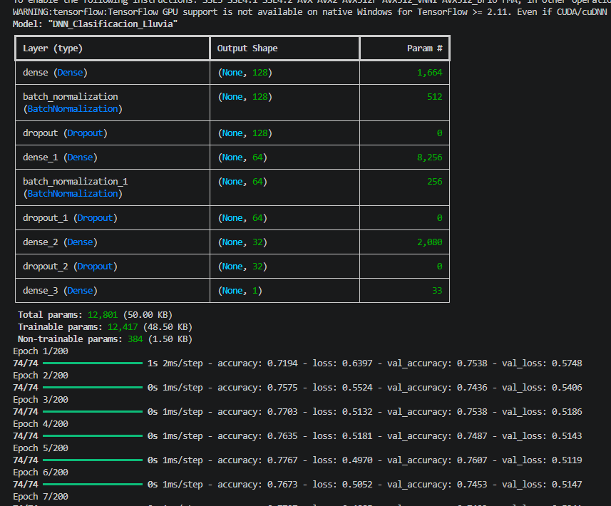
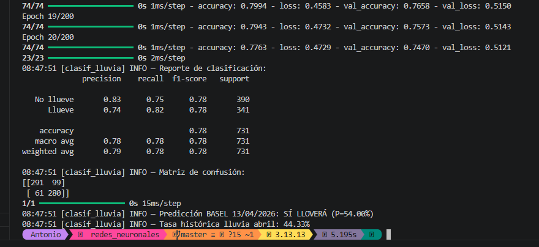

# Memoria Justificativa — Reto de Predicción Meteorológica con DNN

**Dataset utilizado:** Weather Prediction Dataset (Florian Huber, Zenodo/GitHub)  
**Fuente:** https://github.com/florian-huber/weather_prediction_dataset  
**Descripción:** 18 ciudades europeas, observaciones diarias 2000–2010, con variables como temperatura media/máx/mín, humedad, precipitación, presión, cobertura nubosa, radiación global, horas de sol y velocidad del viento.

---

## Script 2: Previsión de Fenómenos (Clasificación Binaria)

### 1. Función de activación en la última capa: `sigmoid`

El problema es binario: llueve (1) o no llueve (0). La función sigmoid mapea la salida de la neurona al rango [0, 1], lo que se interpreta directamente como la probabilidad de que llueva. Con un umbral (por defecto 0.5), se convierte en decisión binaria. Usar softmax con 2 neuronas sería funcionalmente equivalente pero innecesariamente redundante para un caso binario. Usar linear o relu no tendría sentido porque no producen probabilidades.

### 2. Función de coste: `binary_crossentropy`

Es la función de pérdida diseñada específicamente para clasificación binaria. Mide la divergencia entre la distribución predicha (probabilidad sigmoid) y la etiqueta real (0 o 1). Matemáticamente: `-[y·log(p) + (1-y)·log(1-p)]`. Penaliza fuertemente las predicciones muy confiadas que resultan erróneas (predecir 0.99 cuando la realidad es 0). Usar MSE para clasificación no es incorrecto pero genera gradientes subóptimos y superficies de pérdida con mesetas que ralentizan el aprendizaje.

Además, se aplica `class_weight` para compensar el desbalanceo entre días lluviosos y no lluviosos.

### 3. Métricas de evaluación y resultados obtenidos

- **Accuracy: 78%** — el modelo acierta en 3 de cada 4 predicciones.
- **No llueve:** Precision 0.83, Recall 0.75, F1 0.78 (390 muestras).
- **Llueve:** Precision 0.74, Recall 0.82, F1 0.78 (341 muestras).
- **F1-Score global: 0.78** — equilibrado entre ambas clases gracias al class_weight.
- **Matriz de confusión:** 291 verdaderos negativos, 280 verdaderos positivos, 99 falsos positivos, 61 falsos negativos.
- **Predicción 13/04/2026: SÍ LLOVERÁ** con P=54.00%. La tasa histórica de lluvia en abril en Basel es del 44.33%, por lo que la predicción es ligeramente superior pero coherente.

El modelo entrenó solo 20 epochs antes de que el EarlyStopping parara, lo cual indica que convergió rápido. El Recall de 0.82 para la clase "Llueve" es relevante porque para la empresa es más grave no detectar un día de lluvia que dar un falso aviso.

**Criterio de aceptación para la empresa:** F1 de 0.78 y Recall de 0.82 en la clase lluvia superan los umbrales mínimos (F1 > 0.70, Recall > 0.65).