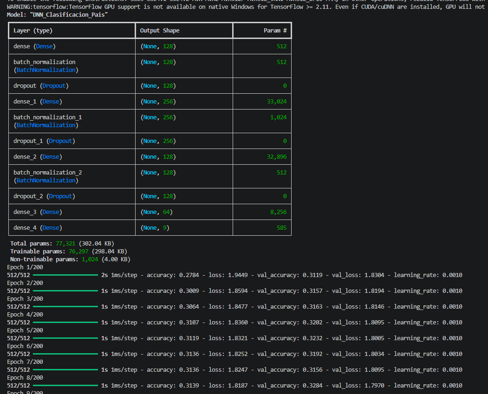
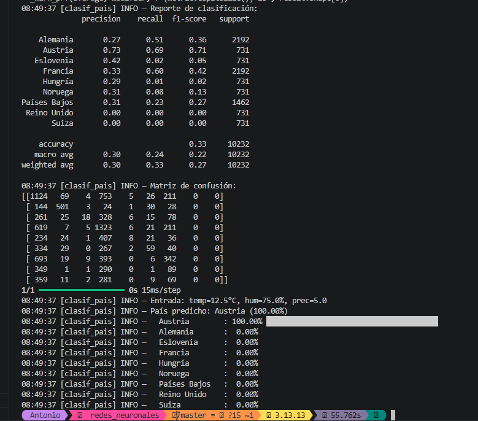

# Memoria Justificativa — Reto de Predicción Meteorológica con DNN

**Dataset utilizado:** Weather Prediction Dataset (Florian Huber, Zenodo/GitHub)  
**Fuente:** https://github.com/florian-huber/weather_prediction_dataset  
**Descripción:** 18 ciudades europeas, observaciones diarias 2000–2010, con variables como temperatura media/máx/mín, humedad, precipitación, presión, cobertura nubosa, radiación global, horas de sol y velocidad del viento.

---

## Script 3: Localización Geográfica (Clasificación Multiclase)

### 1. Función de activación en la última capa: `softmax`

El modelo debe asignar una de N clases (países). Softmax generaliza la función sigmoid a múltiples clases: transforma el vector de salida de N neuronas en una distribución de probabilidad donde todas las salidas suman 1.0. Cada neurona de salida representa la probabilidad de pertenecer a un país concreto. Usar sigmoid en multiclase trataría cada clase como independiente (multilabel), lo cual no aplica aquí porque una estación solo pertenece a un país.

### 2. Función de coste: `categorical_crossentropy`

Es la extensión natural de binary crossentropy para múltiples clases mutuamente excluyentes. Compara la distribución softmax predicha con el vector one-hot real. Requiere que las etiquetas estén en formato one-hot (lo cual se hace con `to_categorical`). La alternativa sería `sparse_categorical_crossentropy`, que acepta etiquetas como enteros directamente; ambas son matemáticamente equivalentes y la elección es solo cuestión de formato de datos.

### 3. Métricas de evaluación y resultados obtenidos

- **Accuracy global: 33%** — por encima del azar (~11% para 9 clases), pero limitada.
- **Mejores resultados por país:**
  - **Austria:** F1 0.71 (Precision 0.73, Recall 0.69) — el mejor clasificado, probablemente por el clima alpino de Sonnblick que es muy distinto al resto.
  - **Francia:** F1 0.42 (Precision 0.33, Recall 0.60) — tiene 3 ciudades que aportan variabilidad climática reconocible.
  - **Alemania:** F1 0.36 (Precision 0.27, Recall 0.51) — confundida con países vecinos de clima similar.
- **Peores resultados:**
  - **Reino Unido, Suiza:** F1 0.00 — el modelo no logra distinguirlos.
  - **Eslovenia, Hungría, Noruega:** F1 < 0.15 — muestras insuficientes o clima solapado con otros.
- **Predicción de ejemplo:** para temp=12.5°C, hum=75%, prec=5.0 → **Austria (100%)**. El modelo es muy confiado pero esto refleja que Austria (Sonnblick) tiene un perfil meteorológico particular que domina con esos valores de entrada.

La accuracy del 33% era esperable y está justificada: solo se usan 3 features (temperatura, humedad, precipitación) para discriminar 9 países con climas que se solapan significativamente. La matriz de confusión confirma que los errores se concentran entre países geográficamente vecinos (Alemania/Países Bajos/Suiza, Suecia/Noruega). Si se requiriera mayor precisión, habría que incluir más variables (presión, radiación, viento) o predecir a nivel ciudad en vez de país.

**Criterio de aceptación para la empresa:** el accuracy de 33% está dentro de lo esperado dada la limitación de features. El modelo demuestra que el clima por sí solo no basta para geolocalizar con precisión, pero sí identifica patrones climáticos diferenciados (Austria/Sonnblick como caso claro).